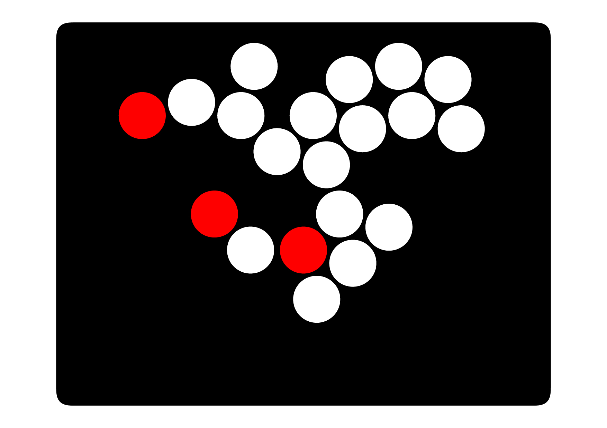

# この説明書はGP2040-CEの補足資料
この説明書は、かぬコンで追加した機能に関する部分のみ説明します。

詳しい使い方は、[GP2040-CE](https://gp2040-ce.info/#/)　をご確認ください。

# Webconfigへのアクセス方法
かぬコンの設定は、Webconfigから行います。

Plusボタンを押しながらPCへ接続（デフォルトのPlusボタンは画像の位置です。）

[Link](http://192.168.7.1)にアクセス
# ファームウェアの更新方法について
Webconfigにアクセス

Rebootをクリック

USB(BOOTSEL)を選択

flash_nuke.uf2をドラックアンドドロップ

しばらく待つと再度ウインドウが表示される

GP2040-CE_0.7.1_WaveshareZero.uf2（ファイル名は変更されている可能性があります。）をドラックアンドドロップ

PCとかぬコンの接続を解除

# TILTボタンについて
かぬコンでは、スマブラ特有の動作をスティックを使わずに再現するためにTILTボタンを設定しています。

Tilt1よりTilt2のほうがスティックの傾きがより小さくなります。

### tilt1

### tilt2

Tiltボタンを押しながら、Right Analogを押すことで上下にシフトさせることができます。
## Pin Mappingでは、方向キーは設定しない
Tiltの機能を使用する場合、Up,Down,Left,Rightの設定は、Add-Ons ConfigurationのTiltから設定を行います。

そのほかのボタンは、こちらで設定可能です。

## Add-Ons ConfigurationのTiltから方向キーを設定

Left Analog（Lスティック）とRight Analog(Cスティック)の設定をしてください。

## FunctionボタンとRight Analogを同時押しでHome,Minus,Plus,Captureが機能する
Functionボタンは、Right Analogと同時押しすることで、Home,Minus,Plus,Captureが機能します。

### Plus

### HOME

### Capture

## Minus

試合中に押すことで、試合が中断する可能性のあるボタンを押しにくくしました。

## Tilt1ボタンとTilt2ボタンを同時に押すことで、Right AnalogがD-Padとして機能する

